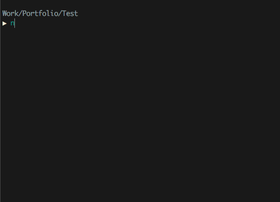

# Version Select

This package allows you to update the version of the package.json file depending on the selected option.

## Usage

- Install package: `npm i -D version-select`
- Add npm script:

``` json
{
    "name": "test",
    "version": "1.0.0",
    "scripts": {
        "version-select": "version-select"
    },
    "devDependencies": {
        "version-select": "^1.0.6"
    }
}
```

- Run npm script:


